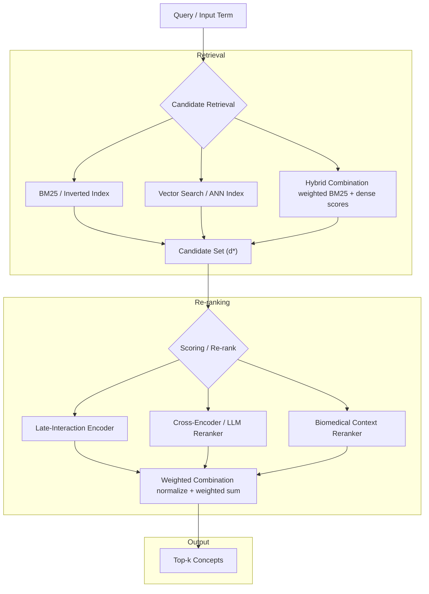

# 🧠 Ontology Concept Mapping Engine


A high-performance **hybrid retrieval + multi-stage re-ranking system** for semantic concept mapping over ontology databases.

---

## 📑 Table of Contents

- [Overview](#-overview)
- [Architecture](#-architecture)
- [Features](#-features)
- [Quick Start](#-quick-start)
- [Configuration](#-configuration)
- [API Endpoints](#-api-endpoints)
- [Indexing](#-indexing)
- [Performance Notes](#-performance-notes)
- [License](#-license)

---

## 🚀 Overview
 
This project implements a **hybrid retrieval system for ontology concept mapping**, based on the design outlined in the official design document: [Search Design Document](https://github.com/sensein/structsense/blob/search_design_doc/docs/design_docs/search_design_doc.md).

It combines **lexical and semantic search** with **multi-stage re-ranking** to accurately map input terms to ontology concepts stored in a local SQLite database. 

---

### 🧠 Core Approach

The system integrates multiple retrieval and ranking strategies:

- **BM25 keyword search** — captures exact and sparse term matches  
- **Dense embeddings** — enables semantic similarity search  
- **Hybrid scoring & re-ranking** — balances lexical precision with semantic recall   

---

## 🏗️ Architecture



---

## ✨ Features

- Hybrid retrieval (BM25 + dense embeddings)
- Modular re-ranking pipeline
- FAISS-backed fast vector search
- Offline index building support
- API-first design (FastAPI)
- Scalable batch concept mapping. It supports a batch request with *4000* concept mapping per requests.

---

## ⚡ Quick Start

### 1. Install dependencies

```bash
pip install -r requirements.txt
```

### 2. Download data

- Ontology DB + indexes + embeddings:
https://huggingface.co/datasets/sensein/ontology-sqlite-vectorstore

Place into:
```
.cache/
``` 
Note: It does not have to be `.cache`, it can be any name. Just make sure to update the environment variables accordingly to point to the correct location. If it doesn't find the indexes, then it will run the pipeline to generate indexes + embeddings, which is very time consuming and depending on your system, can take up to days or more.

### 3. Run server

```bash
python -m uvicorn main:app --reload --port 8000
```

### 4. Docker Deployment
```bash
docker compose up
```

---

## ⚙️ Configuration

### Retrieval

```bash
# Retrieval mode — set both weights to select mode:
#   Hybrid (default):  BM25_WEIGHT=0.3  DENSE_WEIGHT=0.7
#   BM25-only:         BM25_WEIGHT=1.0  DENSE_WEIGHT=0.0
#   Dense-only:        BM25_WEIGHT=0.0  DENSE_WEIGHT=1.0
# A weight of 0.0 skips that retriever entirely (no index built, loaded, or queried).
BM25_WEIGHT=0.3
DENSE_WEIGHT=0.7

EMBEDDING_MODEL=BAAI/bge-small-en-v1.5   # Embedding model (fast, biomedical-friendly)

VECTOR_BACKEND=faiss         # faiss (default) | numpy | chroma
EMBED_CACHE_DIR=.cache/embed_indexes    # Where .npy and FAISS index are stored
BM25_CACHE_DIR=indexes_embedding/bm25_indexes # BM25 index cache directory
CHROMA_DB_PATH=.cache/chroma_db        # Only used when VECTOR_BACKEND=chroma
```

### Re-ranking
Below are the available reranking configuration options. **Note: If you are not using LLM, you do not require Open Router API key**. 

You can use either single re-ranker or ensemble.
- Single:
  - llm              — OpenRouter LLM scoring only
  - late_interaction — ColBERT-like token interaction, local
  - biomedical       — keyword boost, fastest, fully local
- Dual (two rerankers, weights auto-normalised):
  - llm_late         — LLM + late_interaction  (quality + semantics)
  - llm_biomedical   — LLM + biomedical        (quality + domain boost)
  - dual_late        — late_interaction + biomedical  (fully local, no API key needed)
- Triple (all three):
  - ensemble         — all three (default, best quality, slowest)

```bash
# Single reranker:
RERANKER_TYPE=llm              # OpenRouter API only
RERANKER_TYPE=late_interaction # ColBERT-like, local
RERANKER_TYPE=biomedical       # keyword boost, fastest, local

# Dual ensemble (two rerankers, weights auto-normalised):
RERANKER_TYPE=dual_late        # late_interaction + biomedical  ← default (no API key needed)
RERANKER_TYPE=llm_late         # LLM + late_interaction ← requires API key
RERANKER_TYPE=llm_biomedical   # LLM + biomedical ← requires API key

# Triple ensemble:
RERANKER_TYPE=ensemble         # all three (best quality, slowest)

# Weights (used by whichever components are active; inactive components,e.g., weight 0, are ignored)
LLM_WEIGHT=0.5
LATE_INTERACTION_WEIGHT=0.3
BIOMEDICAL_WEIGHT=0.2
```

### LLM Re-ranker (OpenRouter)
```bash
OPENROUTER_API_KEY=sk-or-v1-xxxxx   # Required for LLM reranking
OPENROUTER_MODEL=openrouter/anthropic/claude-3.5-sonnet:beta     # Model selection

# Available models (examples): 
#   google/gemini-2.0-flash-001       (fast, high quality)
#   anthropic/claude-3.5-sonnet:beta  (highest quality)
#   meta-llama/llama-2-70b-chat       (open source)
#   mistral/mistral-7b-instruct:free  (free tier)
```

### Late-Interaction Model
```bash
LATE_INTERACTION_MODEL=jinaai/jina-colbert-v2
```
### Performance
```bash
MAX_CANDIDATES=20            # Candidates retrieved before re-ranking
MAX_RESULTS=5                # Default max results per query
INDEX_CACHE_DIR=.cache/ontology_indexes
EMBED_CACHE_DIR=.cache/embed_indexes
DATABASE_PATH=bioportal.db
```

---

## 📡 API Endpoints


| Endpoint | Method | Purpose |
|----------|--------|---------|
| `/map/concept` | POST | Map a **single** term; returns `retrieval_scores`; uses `MAX_CANDIDATES=20` |
| `/map/search` | POST | Like `/map/concept` but uses `MAX_CANDIDATES=30` (larger pool); designed for context-heavy disambiguation; no `retrieval_scores` in response |
| `/map/batch` | POST | Map **up to 4000** concepts in one call; accepts comma-string, list, or `{text, context}` objects |
| `/config` | GET | Current server configuration (reranker type, model, backend — no secrets) |
| `/health` | GET | Readiness check |
| `/stats` | GET | DB + index statistics |
| `/ontologies` | GET | List all available ontologies |

**When to use which mapping endpoint:**

- **`/map/concept`** — default for single-term lookups. Use when you have a clean term (`"diabetes mellitus"`, `"COPD"`) and want retrieval scores for debugging.
- **`/map/search`** — use when you have rich context (clinical note snippet, definition, related terms) and disambiguation matters (`"cold"` → `"common cold"` vs `"cold weather"`).  
- **`/map/batch`** — use when mapping many terms at once to reduce API round trips. Per-concept context is supported via the `{text, context}` object format. **It supports upto 4000 concepts mapping per request.**


---

## 🏗️ Indexing

Use `build_index.py` to generate all indexes before starting the server. Note, building indexes is very time consuming task. You can download it from [https://huggingface.co/datasets/sensein/ontology-sqlite-vectorstore](https://huggingface.co/datasets/sensein/ontology-sqlite-vectorstore) and place it on `.cache` directory.

```bash
# Build with default settings (reads from .env)
python build_index.py

# Explicitly choose backend
python build_index.py --backend faiss    # default
python build_index.py --backend numpy    # no faiss-cpu required

# Force rebuild even if caches exist
python build_index.py --force

# Use a non-default database
python build_index.py --db /data/bioportal.db
```

---

## ⚡ Performance Notes

- FAISS recommended for production (~50ms search)
- Avoid Chroma for large datasets
- Use dual_late for best local performance
- Ensemble gives best accuracy (slowest)

---

## 📄 License

Apache 2.0
