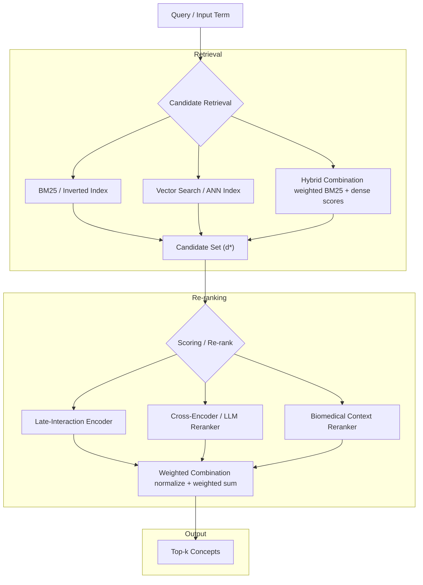

# Search

This implements the search functionality described on the following design document for concept mapping with hybrid retrieval (BM25 + dense embeddings) with pointwise multi-stage re-ranking to find semantically accurate concept mappings from a local SQLite database.

[https://github.com/sensein/structsense/blob/search_design_doc/docs/design_docs/search_design_doc.md](https://github.com/sensein/structsense/blob/search_design_doc/docs/design_docs/search_design_doc.md)


## Architecture

For details please refer to [https://github.com/sensein/structsense/blob/search_design_doc/docs/design_docs/search_design_doc.md](https://github.com/sensein/structsense/blob/search_design_doc/docs/design_docs/search_design_doc.md) document.
## Running
- Build the index (offline preferred) or download it from [https://huggingface.co/datasets/sensein/ontology-sqlite-vectorstore](https://huggingface.co/datasets/sensein/ontology-sqlite-vectorstore) and put all the indexes/embeddings inside `.cache` directory. Note that it doesn't have to be `.cache` directory, it can be any depends on how you configure in `.env` file.
- Download the `bioportal.db` from the [https://huggingface.co/datasets/sensein/ontology-sqlite-vectorstore](https://huggingface.co/datasets/sensein/ontology-sqlite-vectorstore).
- Run either using `python -m uvicorn main:app --reload --port 8000` or via docker compose.
## Configuration
### Retrieval

```bash
# Retrieval mode — set both weights to select mode:
#   Hybrid (default):  BM25_WEIGHT=0.3  DENSE_WEIGHT=0.7
#   BM25-only:         BM25_WEIGHT=1.0  DENSE_WEIGHT=0.0
#   Dense-only:        BM25_WEIGHT=0.0  DENSE_WEIGHT=1.0
# A weight of 0.0 skips that retriever entirely (no index built, loaded, or queried).
BM25_WEIGHT=0.3
DENSE_WEIGHT=0.7

EMBEDDING_MODEL=BAAI/bge-small-en-v1.5   # Embedding model (fast, biomedical-friendly)

VECTOR_BACKEND=faiss         # faiss (default) | numpy | chroma
EMBED_CACHE_DIR=.cache/embed_indexes    # Where .npy and FAISS index are stored
CHROMA_DB_PATH=.cache/chroma_db        # Only used when VECTOR_BACKEND=chroma
```

### Re-ranking
```bash
# Single reranker:
RERANKER_TYPE=llm              # OpenRouter API only
RERANKER_TYPE=late_interaction # ColBERT-like, local
RERANKER_TYPE=biomedical       # keyword boost, fastest, local

# Dual ensemble (two rerankers, weights auto-normalised):
RERANKER_TYPE=dual_late        # late_interaction + biomedical  ← default (no API key needed)
RERANKER_TYPE=llm_late         # LLM + late_interaction
RERANKER_TYPE=llm_biomedical   # LLM + biomedical

# Triple ensemble:
RERANKER_TYPE=ensemble         # all three (best quality, slowest)

# Weights (used by whichever components are active; inactive components are ignored)
LLM_WEIGHT=0.5
LATE_INTERACTION_WEIGHT=0.3
BIOMEDICAL_WEIGHT=0.2
```

### LLM Re-ranker (OpenRouter)
```bash
OPENROUTER_API_KEY=sk-or-v1-xxxxx   # Required for LLM reranking
OPENROUTER_MODEL=openrouter/anthropic/claude-3.5-sonnet:beta     # Model selection

# Available models (examples): 
#   google/gemini-2.0-flash-001       (fast, high quality)
#   anthropic/claude-3.5-sonnet:beta  (highest quality)
#   meta-llama/llama-2-70b-chat       (open source)
#   mistral/mistral-7b-instruct:free  (free tier)
```

### Late-Interaction Model
```bash
LATE_INTERACTION_MODEL=jinaai/jina-colbert-v2
```
### Performance
```bash
MAX_CANDIDATES=20            # Candidates retrieved before re-ranking
MAX_RESULTS=5                # Default max results per query
INDEX_CACHE_DIR=.cache/ontology_indexes
EMBED_CACHE_DIR=.cache/embed_indexes
DATABASE_PATH=bioportal.db
```

### API Server
```bash
API_HOST=0.0.0.0
API_PORT=8000
API_RELOAD=false
LOG_LEVEL=INFO
```

## Endpoint Overview

| Endpoint | Method | Purpose |
|----------|--------|---------|
| `/map/concept` | POST | Map a **single** term; returns `retrieval_scores`; uses `MAX_CANDIDATES=20` |
| `/map/search` | POST | Like `/map/concept` but uses `MAX_CANDIDATES=30` (larger pool); designed for context-heavy disambiguation; no `retrieval_scores` in response |
| `/map/batch` | POST | Map **up to 20** concepts in one call; accepts comma-string, list, or `{text, context}` objects |
| `/config` | GET | Current server configuration (reranker type, model, backend — no secrets) |
| `/health` | GET | Readiness check |
| `/stats` | GET | DB + index statistics |
| `/ontologies` | GET | List all available ontologies |

**When to use which mapping endpoint:**

- **`/map/concept`** — default for single-term lookups. Use when you have a clean term (`"diabetes mellitus"`, `"COPD"`) and want retrieval scores for debugging.
- **`/map/search`** — use when you have rich context (clinical note snippet, definition, related terms) and disambiguation matters (`"cold"` → `"common cold"` vs `"cold weather"`).  
- **`/map/batch`** — use when mapping many terms at once to reduce API round trips. Per-concept context is supported via the `{text, context}` object format.

## Pre-building Indexes Offline

Use `build_index.py` to generate all indexes before starting the server. Note, building indexes is very time consuming task. You can download it from [https://huggingface.co/datasets/sensein/ontology-sqlite-vectorstore](https://huggingface.co/datasets/sensein/ontology-sqlite-vectorstore) and place it on `.cache` directory.
```bash
# Build with default settings (reads from .env)
python build_index.py

# Explicitly choose backend
python build_index.py --backend faiss    # default
python build_index.py --backend numpy    # no faiss-cpu required

# Force rebuild even if caches exist
python build_index.py --force

# Use a non-default database
python build_index.py --db /data/bioportal.db
```
