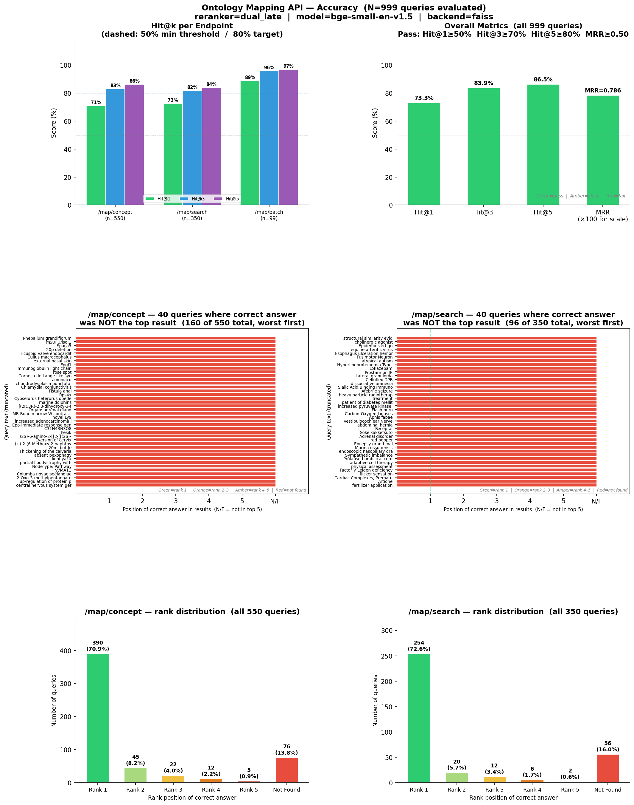
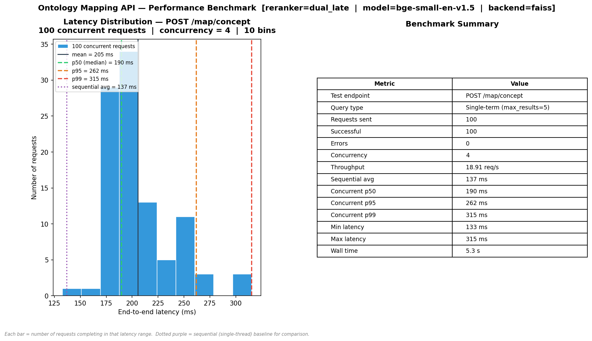
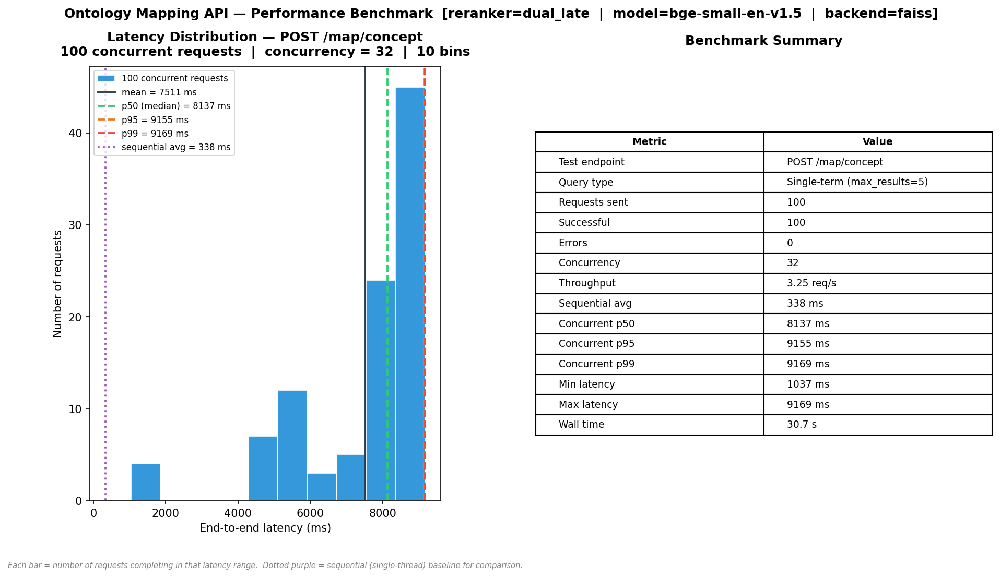

# Tests

Functional tests, accuracy evaluation, performance benchmarking, and batch size analysis for the Ontology Mapping API.

## Files

| File | Purpose                                                   |
|------|-----------------------------------------------------------|
| `test_api.py` | Main test runner — functional, accuracy, perf, batch size variation |
| `build_golden_set.py` | Generate `golden_set.json` from `bioportal.db`            |
| `golden_set.json` | Auto-generated golden set (~900 single + 33 batch groups) |

## Running Tests

The API server must be running (`GET /health` → `indexing_complete: true`) before running tests.

### Functional tests only
```bash
python test_api.py
```

### Accuracy evaluation (all ~900 entries — takes ~5–15 min depending on reranker)
```bash
python test_api.py --accuracy
```

### Quick accuracy smoke-test (first 100 entries only)
```bash
python test_api.py --accuracy --max-accuracy 100
```

### Performance benchmark
```bash
python test_api.py --perf                          # 100 requests, concurrency=4
python test_api.py --perf --n-requests 200 --concurrency 8
```

### Batch size variation (tests batch sizes 5, 10, 15, 20 at 100%, 50%, 25% of batch golden set)
```bash
python test_api.py --batch-sizes
```

### Everything
```bash
python test_api.py --all
python test_api.py --all --max-accuracy 200   # accuracy capped at 200 for speed
```

### Verbose (per-query details)
```bash
python test_api.py --accuracy --verbose
```

### Save plots (requires `pip install matplotlib`)
```bash
python test_api.py --all --plot --plot-dir test_results/
```

### Save plots + CSV data files
```bash
python test_api.py --all --plot --csv --plot-dir test_results/
```

### Against a non-default host
```bash
python test_api.py --url http://my-server:8000 --accuracy
```

---

## Output Files

When `--plot` and/or `--csv` are used, files are saved to `--plot-dir`. The below shows an example output that `test_results` plot directory contains.

```
test_results/
├── accuracy_20260311_143000.png          # 3-row accuracy figure (see below)
├── performance_20260311_143000.png       # latency histogram + summary table
├── batch_sizes_20260311_143000.png       # latency + Hit@k vs batch size (3 subsets)
├── accuracy_per_query_20260311_143000.csv   # one row per query: rank, hit@k, RR
├── accuracy_summary_20260311_143000.csv     # Hit@k% and MRR per endpoint + overall
├── perf_latencies_20260311_143000.csv       # per-request latency (ms)
├── perf_summary_20260311_143000.csv         # p50, p95, p99, throughput, wall time
├── batch_sizes_20260311_143000.csv          # accuracy + latency at each batch size/subset
└── config_20260311_143000.json              # server config snapshot from /config endpoint
```

CSV files are timestamped so multiple runs do not overwrite each other. Use them to regenerate plots later or compare runs across configurations.

---

## Figures

### Accuracy figure (`accuracy_*.png`) — 3 rows × 2 columns

**Row 1 — Summary metrics**
- *Left*: Hit@1 / Hit@3 / Hit@5 grouped bars per endpoint (`/map/concept`, `/map/search`, `/map/batch`), showing N per endpoint
- *Right*: Overall Hit@1 / Hit@3 / Hit@5 / MRR across all N evaluated queries, colour-coded pass/fail

**Row 2 — 40 hardest queries per endpoint**
- *Left*: `/map/concept` — the 40 queries with the worst rank (not-found and highest ranks first); sorted worst→best
- *Right*: `/map/search` — same, for the contextual search endpoint
- Shows which specific queries the system struggles with most

**Row 3 — Full dataset rank distribution**
- *Left*: `/map/concept` — all evaluated queries bucketed as Rank 1 through 5, Not Found, with count and % label
- *Right*: `/map/search` — same for the search endpoint
- Shows the complete picture across all tested queries, not just a sample
 

### Performance figure (`performance_*.png`) — 2 panels

- *Left*: Latency distribution histogram. **Y-axis = number of requests** with that latency. Vertical dashed lines at p50/p95/p99. Dotted purple line = sequential (single-thread) average. Caption explains each bar and the baseline. Title states endpoint, N requests, and concurrency.
- *Right*: Benchmark summary table showing endpoint, query type, requests sent, successful, errors, throughput, sequential baseline, p50/p95/p99, min, max, wall time.

Default runs 100 requests to `POST /map/concept` with single-term queries cycling through 20 common terms. Use `--n-requests N` to increase.

### Batch size figure (`batch_sizes_*.png`) — 2 panels per subset

Three subsets tested: full (100%), half (50%), quarter (25%) of the batch golden set.
Batch sizes tested: 5, 10, 15, 20 concepts per `/map/batch` request (API hard limit = 20).

For each subset:
- *Left*: Average request wall time (ms) vs batch size. Each point annotated with latency, number of requests, and total concepts.
- *Right*: Hit@1 and Hit@5 accuracy vs batch size. Caption explains that accuracy should stay flat (same concepts, different grouping).

---

## Golden Set

`golden_set.json` is generated from `bioportal.db` by `build_golden_set.py`. It contains:

| Group | Count | Endpoint | Description |
|-------|-------|----------|-------------|
| `exact_match_no_context` | ~350 | `/map/concept` | Real preferred labels as queries, no context |
| `exact_match_with_definition_context` | ~250 | `/map/search` | Real preferred labels + their DB definition as context |
| `synonym_as_query` | ~200 | `/map/concept` | Synonym used as query; acceptable = preferred label |
| `alt_label_as_query_with_definition_context` | ~100 | `/map/search` | Alt label as query + definition context |
| `batch_groups` | ~33 groups | `/map/batch` | Groups of 3 concepts tested via batch endpoint |

All entries are grounded in actual DB content — labels, synonyms, and definitions are extracted directly from `bioportal.db`.

### Regenerating the golden set

```bash
python build_golden_set.py                          # default: 1000 entries, seed=42
python build_golden_set.py --size 500               # fewer entries
python build_golden_set.py --seed 99                # different sample
python build_golden_set.py --db /path/to/bioportal.db --out golden_set.json
```

---

## Endpoint Coverage

| Endpoint | Functional | Accuracy | Perf benchmark | Batch size test |
|----------|------------|----------|----------------|-----------------|
| `POST /map/concept` | ✓ | ✓ (exact match + synonym groups) | ✓ (100 requests) | — |
| `POST /map/search`  | ✓ | ✓ (definition context + alt-label groups) | — | — |
| `POST /map/batch`   | ✓ (3 formats) | ✓ (batch groups) | — | ✓ (sizes 5/10/15/20) |
| `GET /health`       | ✓ | — | — | — |
| `GET /ontologies`   | ✓ | — | — | — |
| `GET /stats`        | ✓ | — | — | — |
| `GET /config`       | ✓ (metadata fetch) | — | — | — |

---

## Accuracy Thresholds

| Metric | Pass threshold |
|--------|----------------|
| Hit@1 | ≥ 50% |
| Hit@3 | ≥ 70% |
| Hit@5 | ≥ 80% |
| MRR   | ≥ 0.50 |

Results are reported separately for `/map/concept`, `/map/search`, `/map/batch`, and combined overall.

---

## Checking Current Server Config

Before running accuracy tests, inspect the active configuration:
```bash
curl -s http://localhost:8000/config | python -m json.tool
```

This shows the active reranker type, embedding model, vector backend, and other settings. The config is also automatically saved to `config_<timestamp>.json` when `--csv` is used.

## Results
The following directories contains the test results run in different system.
- [test_results_mac](test_results_mac): Ran on System: Apple M3 Pro 36 GB RAM with default settings.
    
    
- [test_results_gpu_concurrency32](test_results_gpu_concurrency32) Ran on Engaging with 32 concurrent requests. For details about the system configuration, check `systemconfig.txt`.
    
    

